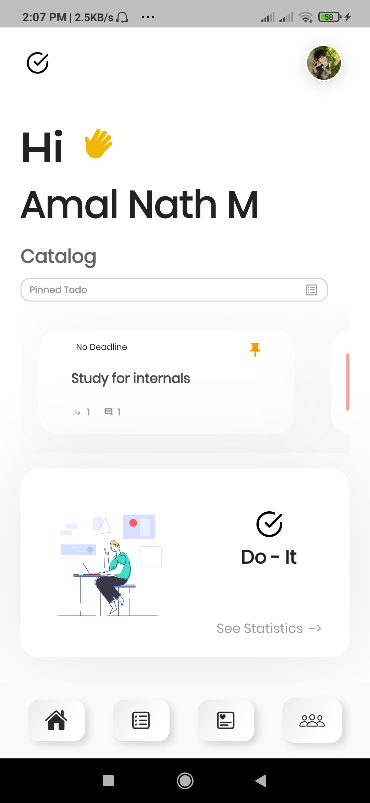
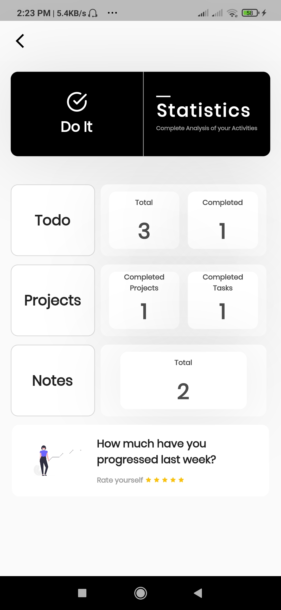
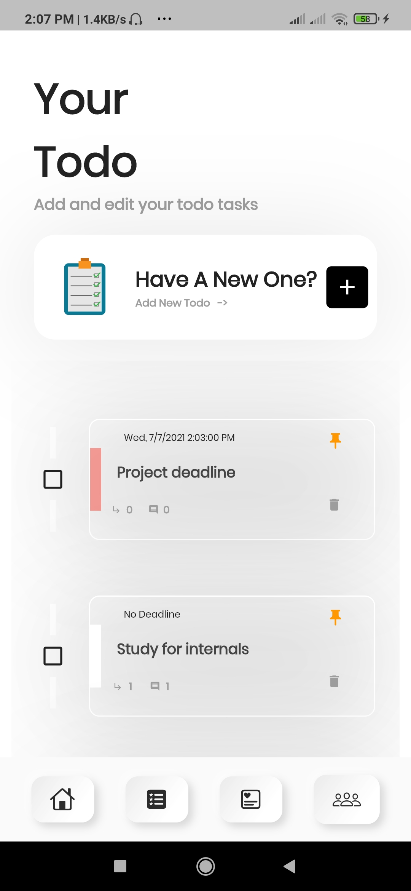
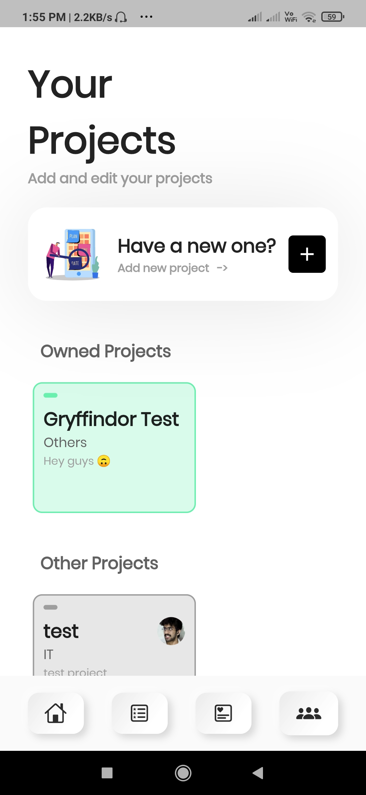
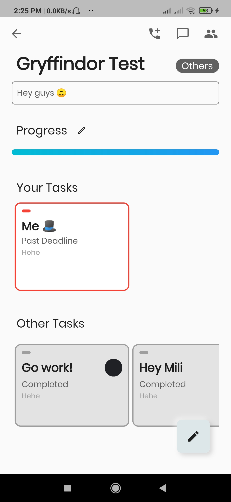
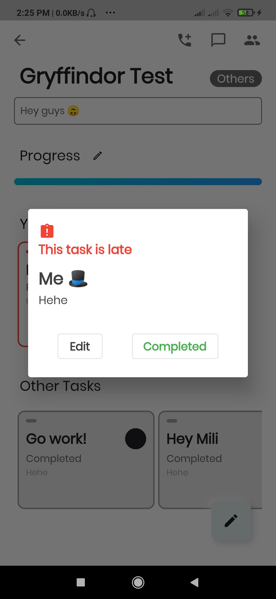
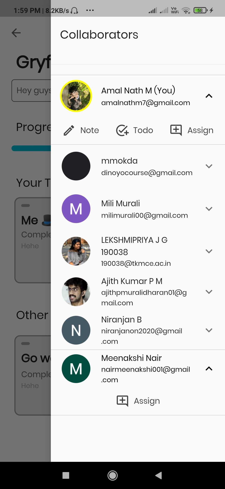
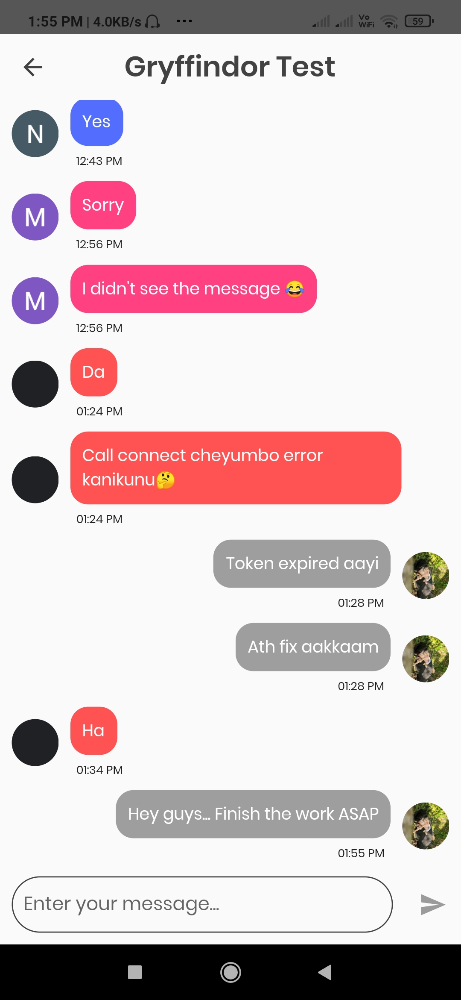
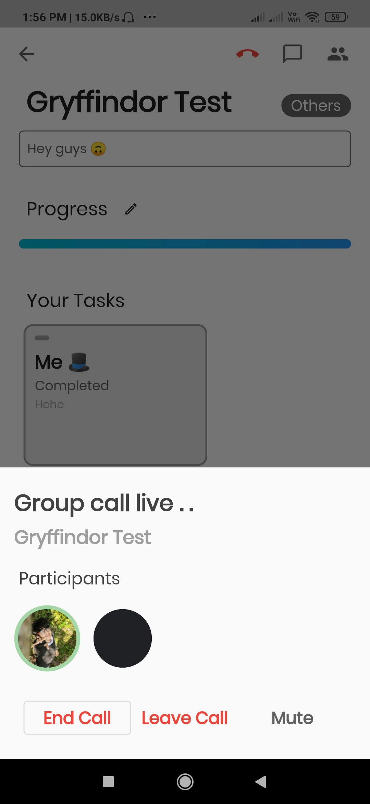

  

# Do-It
A Todo-cum-Project Management Application to improve productivity.

### How to install
Download your compatible APK (Out of the three android binaries, arm64-v8a would be compatible for most devices) and install it in your device. 
Make sure to disable Google Play Protect since we have not published the application yet.

### How _Do-It_ works
Do-It is a cross-platform productivity application developed in Flutter. It helps users keep track of their notes, to-do and projects. 
Users can add important notes, keep track of daily to-do's and manage different projects. 
In addition, users can collaborate with each other under various projects, assign and complete tasks and have a group voice call or a group chat conversation. 

### Key features
1. _Cross-platform support_
2. _Accessible in multiple devices at the same time_
3. _To-do and Notes - Create, Edit, Complete and Delete_
4. _Project Management - Assign and complete tasks_
5. _Group Projects - Group chat and voice call_
6. _Statistics - Record of the total and completed tasks, to-do's and notes_
7. _Sleek and simple UI_

### Screenshots
 
 
 
 
 